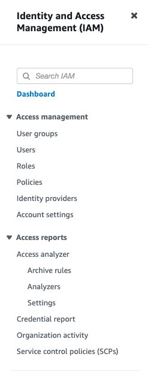
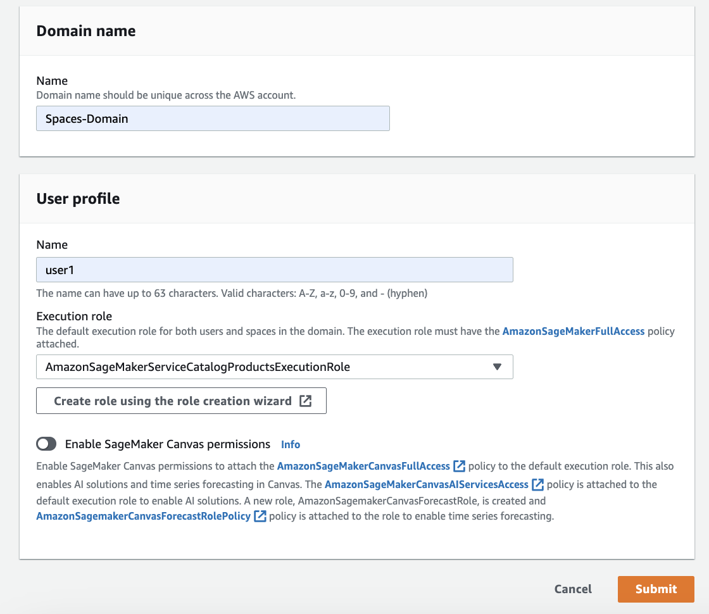

## Amazon SageMaker Spaces configuration

To get started, you first need to create a source code repository

## AWS CodeCommit version control
* In the web browser, log in with your AWS credentials to the AWS Management console at https://console.aws.amazon.com/
* You can search for 'code' in the search bar and select 'CodeCommit'

* When you go to the CodeCommit page, click on the 'Create repository' button.

* Enter a name for your repository and click on the 'Create' button at the bottom right corner.

* AWS CodeCommit repository has been successfully created. Example: https://git-codecommit.us-east-1.amazonaws.com/v1/repos/spaces-repo 


## IAM Policy to access the CodeCommit repository
To create an IAM policy to access the CodeCommit repository, follow these steps:
* In the AWS Management console and navigate to the IAM service.

* Click on the 'Policies' link in the left-hand menu.

* Click on the 'Create policy' button.

* Select the 'JSON' tab and enter the following policy document, replacing '123456789012' with the Account information of your CodeCommit repository.
``````json
{
    "Version": "2012-10-17",
    "Statement": [
        {
            "Sid": "CodeCommitPolicy",
            "Effect": "Allow",
            "Action": "codecommit:*",
            "Resource": "arn:aws:codecommit:us-east-1:123456789012:spaces-repo"
        }
    ]
}
``````
* Click on the 'Review policy' button.

* Enter a name for your policy and click on the 'Create policy' button.


## SageMaker Spaces
Create a SageMaker domain, follow these steps:
* Log in to the AWS Management Console and navigate to the SageMaker service.

* Click on the 'Create domain' button.

* Enter a name for your domain, user profile name, and execution role. Click on the "Submit" button.

* The successfully created domain is displayed.

* You can view the recently created domain by selecting it and clicking 'View' button.

* Create another user 'user2' by clicking 'Add user' button. Assign appropriate execution role 'AmazonSageMakerServiceCatalogProductsExecutionRole'.

* Select the user profile from the dropdown of 'user1' and then select Collabrative 'Spaces'

* Creating the Jupyter notebook and launches the Amazon Sagemaker studio 
* In Studio toolbar, go to File >> New >> Terminal launches CLI.
* Check out the codecommit url using Git CLI command

* Create Notebook file 'HelloWorld.ipynb' and commit to CodeCommit

* Launch user2 in new browser window using Collabrative Spaces.
* Both users (user1 and user2) can expeiences for someone editing the notebook


## Conclusion
In this post, I've shown how to use Amazon SageMaker spaces to organize your ML resources, collaborate with team members, and streamline ML workflow. I've also demostrated how to use AWS CodeCommit repositories to version control using ML code.


## References
 - [Onboard to Amazon SageMaker Domain Using Quick setup](https://docs.aws.amazon.com/sagemaker/latest/dg/onboard-quick-start.html)
 - [How to manage Amazon SageMaker code with AWS CodeCommit](https://aws.amazon.com/blogs/publicsector/how-to-manage-amazon-sagemaker-code-aws-codecommit/)
 - [AWS Policy Generator](https://awspolicygen.s3.amazonaws.com/policygen.html)
 - [Collaborate with shared spaces](https://docs.aws.amazon.com/sagemaker/latest/dg/domain-space.html)
 - [Organize machine learning development using shared spaces in SageMaker Studio for real-time collaboration](https://aws.amazon.com/blogs/machine-learning/organize-machine-learning-development-using-shared-spaces-in-sagemaker-studio-for-real-time-collaboration/)


